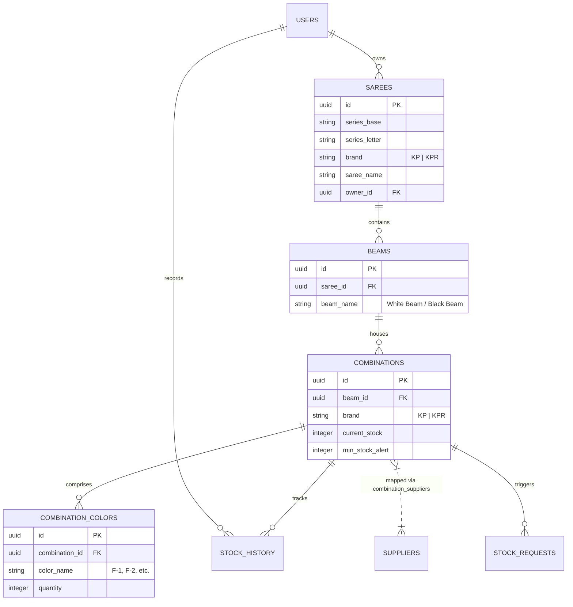
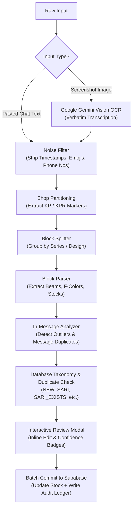
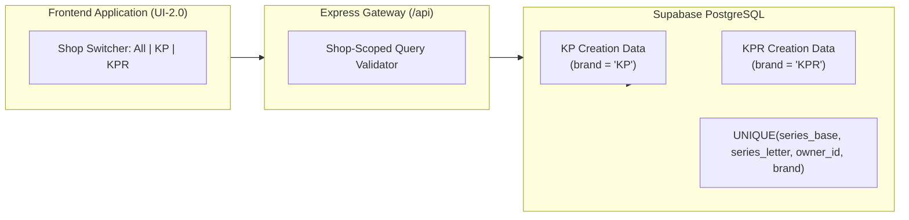

# 🧵 Sari Stock Management System (KP & KPR Creation)

[](https://react.dev/)
[](https://vitejs.dev/)
[](https://tailwindcss.com/)
[](https://ui.shadcn.com/)
[](https://nodejs.org/)
[](https://expressjs.com/)
[](https://supabase.com/)
[](https://ai.google.dev/)

Welcome to the **Sari Stock Management System** — a modern, full-stack enterprise inventory coordination and production tracking platform engineered specifically for textile manufacturers, weavers, and sari wholesale distributors.

Designed for high-velocity operations, the platform manages multi-shop inventories (**KP Creation** & **KPR Creation**), complete loom production structures (Saree ➔ Beams ➔ Combinations ➔ Colors), automated **WhatsApp message & screenshot OCR parsing**, tamper-proof **transaction history ledgers with 1-click rollbacks**, intelligent **duplicate entry prevention**, and **supplier purchase ordering**.

---

## 📖 Table of Contents

- [Key Features](#-key-features)
- [System Architecture & Data Flows](#-system-architecture--data-flows)
  - [Hierarchical Data Model](#hierarchical-data-model)
  - [WhatsApp & Vision OCR Ingestion Pipeline](#whatsapp--vision-ocr-ingestion-pipeline)
  - [Multi-Shop Isolation Architecture](#multi-shop-isolation-architecture)
- [Tech Stack](#-tech-stack)
- [Project Directory Layout](#-project-directory-layout)
- [Getting Started](#-getting-started)
  - [Prerequisites](#prerequisites)
  - [Backend Configuration (`server/.env`)](#backend-configuration-serverenv)
  - [Frontend Configuration (`client/.env`)](#frontend-configuration-clientenv)
  - [Installation](#installation)
  - [Running the Application](#running-the-application)
- [Database Schema & Migration Sequence](#-database-schema--migration-sequence)
  - [Default Seed Accounts](#default-seed-accounts)
- [Advanced Subsystems](#-advanced-subsystems)
  - [WhatsApp Text & Screenshot OCR Parser](#1-whatsapp-text--screenshot-ocr-parser)
  - [Multi-Shop Isolation (KP vs. KPR)](#2-multi-shop-isolation-kp-vs-kpr)
  - [Duplicate Entry Detection & Protection](#3-duplicate-entry-detection--protection)
  - [Audit Ledger, Rollback & Undo](#4-audit-ledger-rollback--undo)
  - [Supplier CRM & WhatsApp Purchase Orders](#5-supplier-crm--whatsapp-purchase-orders)
- [REST API Endpoints Reference](#-rest-api-endpoints-reference)
- [Security, RLS & Rate Limiting](#-security-rls--rate-limiting)
- [Production Deployment](#-production-deployment)
- [License](#-license)

---

## ✨ Key Features

### 🧵 Textile-Native Hierarchical Inventory
Eliminates structural ambiguity by aligning digital records directly with weaving loom realities:
* **Saree (Design Series)**: Root product entry tracking series base and letter (e.g., `KS526F`, `1001A`), name, description, high-res photos, target pricing, and shop ownership (`KP` or `KPR`).
* **Beams**: Warp beam specifications (e.g., *White Beam*, *Black Beam*, *Zari Warp*) attached to each sari design.
* **Combinations (SKUs)**: Discrete stock-holding units configured with minimum alert thresholds and current balances.
* **Combination Colors**: Granular color breakdowns including mill/dye numbers (e.g., `F-1 Red`, `F-2 Rama Green`, `F-3 Rani Pink`).

### 🏬 Strict Multi-Shop Isolation (KP Creation & KPR Creation)
* Independent inventory scopes for **KP** and **KPR** brands under tenant isolation.
* Series codes can coexist across both shops independently without database key collisions (e.g., `KS500` in KP and `KS500` in KPR maintain separate beams, combinations, and stock).
* Filter by shop across all catalogs, dashboards, low-stock reports, and WhatsApp batch importers.

### 🤖 Intelligent WhatsApp Parser & Gemini Vision OCR
* **Text Message Parsing**: Paste unformatted chat logs directly from WhatsApp groups or manager memos. Automatically cleans timestamps, sender names, and emojis, splits blocks, detects shop markers, and tokenizes series, beams, and color quantities.
* **Screenshot Vision OCR**: Powered by Google Gemini Vision (`gemini-2.0-flash`). Upload screenshots of mobile WhatsApp chats; the OCR engine transcribes text verbatim and pipes it straight into the parsing pipeline.
* **Confidence Scoring & Status Taxonomy**: Visual confidence gauge (0–100%) and canonical classification: `NEW_SARI`, `NEW_COMBINATION`, `SARI_EXISTS`, `COMBINATION_EXISTS`, `SIMILAR`, `DUPLICATE_IN_MESSAGE`, `MISSING_INFO`, `INVALID`.
* **Interactive Pre-Import Editor**: Review parsed batches in an editable table, resolve warnings, adjust quantities or color mappings, toggle rows, and commit verified records in a single click.

### 🛡️ Duplicate Entry Prevention
* Real-time validation checks for existing series codes, duplicate combinations, and overlapping WhatsApp entries within configurable timeframes.
* Prevents multiple staff members or weavers from logging the same shipment or stock cut twice.

### 📜 Real-Time Audit Ledger with 1-Click Rollback
* Every manual edit, WhatsApp import, or quick adjustment is logged in an immutable `stock_history` ledger.
* Captures previous stock, new stock, net delta, user identity, change reason, and timestamps.
* **Undo & Administrative Rollback**: Revert accidental stock entries instantly with guaranteed state consistency.

### 🤝 Supplier Hub & WhatsApp Purchase Orders
* Manage supplier profiles with contact details, company names, and combination mappings.
* Detect items dipping below safety thresholds and auto-generate stock replenishment requests.
* **1-Click WhatsApp PO Generator**: Formats purchase orders with clean markdown (`*bold*` series headers, itemized F-color quantities, and order references) ready to send to mills and dye houses.

### 💎 Modern Luxury UI-2.0 & SaaS Landing Page
* Re-engineered using **shadcn/ui**, **Radix UI**, and **Tailwind CSS** with a warm luxury textile aesthetic.
* High-converting SaaS landing page featuring an animated hero with real sari photography, feature spotlights, workflow breakdowns, transparent 3-tier pricing (Pro, Team, Enterprise), and instant demo booking.
* Rich dashboard with KPI cards, stock trends, global search modal (`Ctrl/Cmd + K`), barcode generation (`JsBarcode`), QR code tags (`qrcode.react`), and export to PDF/Excel.

---

## 🏗 System Architecture & Data Flows

### Hierarchical Data Model



### WhatsApp & Vision OCR Ingestion Pipeline



### Multi-Shop Isolation Architecture



---

## 🛠 Tech Stack

| Domain | Technology | Details |
| :--- | :--- | :--- |
| **Frontend Framework** | React 19 + Vite 8 | Ultra-fast build toolchain with Hot Module Replacement |
| **Design System** | Tailwind CSS v3 + Radix UI | Custom luxury theme built on shadcn/ui component primitives |
| **Component Library** | Material UI (MUI) v9 + Emotion | Specialized forms, dynamic modals, and smooth animations |
| **Icons & Media** | Lucide React + MUI Icons | Crisp vector iconography |
| **Routing & State** | React Router v7 + Context API | Protected route wrappers and granular auth/tenant state |
| **Charts & Metrics** | Recharts 3.9 | Interactive area charts, stock trend graphs, and KPI visualizers |
| **Barcodes & Print** | JsBarcode + QRCode.react + jsPDF | Barcode labeling, QR generation, PDF reports, Excel (`xlsx`) export |
| **Backend Runtime** | Node.js (v18+) + Express 5 | High-performance RESTful API with structured routing |
| **Database & Auth** | Supabase (PostgreSQL 15) | Row-Level Security (RLS), triggers, constraints, JWT auth |
| **Artificial Intelligence** | Google Gemini Vision (2.0 Flash) | Screenshot OCR extraction and demand forecast analytics |
| **Security & Middleware** | Helmet, CORS, Express-Rate-Limit | Multi-tier rate limiting, secure headers, proxy trust configuration |

---

## 📂 Project Directory Layout

```text
Saree_management/
├── client/                               # Frontend Single Page Application
│   ├── public/                           # Static assets, hero images, and branding
│   ├── src/
│   │   ├── components/
│   │   │   ├── common/                   # GlobalSearchDialog, WhatsAppImportDialog, ProtectedRoute
│   │   │   ├── layout/                   # Header, Sidebar, Layout wrappers
│   │   │   └── ui/                       # shadcn/ui primitives (button, card, dialog, table, badge, etc.)
│   │   ├── contexts/                     # AuthContext (Supabase session), AppContext (Theme & Shop)
│   │   ├── lib/                          # Utility helpers (cn, formatters)
│   │   ├── pages/                        # LandingPage, Dashboard, AllSarees, LowStock, StockHistory,
│   │   │                                 # StockRequests, SareeDetail, SareeForm, SareeEdit, Settings, Login
│   │   ├── services/                     # Axios API client (api.js), Supabase client (supabase.js)
│   │   └── theme/                        # Palette configuration and luxury styling tokens
│   ├── index.html                        # Application entry HTML
│   ├── package.json                      # Client dependencies & scripts
│   ├── tailwind.config.js                # Tailwind theme customization
│   └── vite.config.js                    # Vite configuration
│
├── server/                               # Backend REST API Server
│   ├── config/                           # Supabase admin client configuration
│   ├── controllers/                      # authController, sareeController, stockController,
│   │                                     # parserController, duplicateController, supplierController, etc.
│   ├── middleware/                       # auth (JWT), validation, rate-limiting, error handler
│   ├── routes/                           # auth, sarees, stock, suppliers, stockRequests, parser,
│   │                                     # dashboard, settings, upload, duplicates
│   ├── services/                         # Business logic engines
│   │   ├── DuplicateDetectionService.js  # Fuzzy match & duplicate prevention
│   │   ├── OcrService.js                 # Gemini Vision OCR integration
│   │   └── parser/                       # WhatsAppParserEngine, NoiseFilter, BlockParser,
│   │                                     # BlockSplitter, ShopParser, InMessageAnalyzer
│   ├── package.json                      # Server dependencies & scripts
│   └── server.js                         # Express entry point (default port: 5001)
│
├── database/                             # PostgreSQL Database Migrations & Schemas
│   ├── schema.sql                        # Base tables (users, sarees, beams, combos, history)
│   ├── suppliers_migration.sql           # Suppliers directory & purchase request ledger
│   ├── shop_isolation_migration.sql      # Mandatory KP/KPR isolation & compound uniqueness
│   ├── duplicate_detection_constraints.sql # Constraints and indexes for anti-duplication
│   ├── history_ledger_migration.sql      # Audit trail & rollback functions
│   ├── combination_images_migration.sql  # Image support per combination SKU
│   └── multi_tenant_isolation_v2.sql     # Row-Level Security policies
│
├── .env.example                          # Blueprint for environment variables
├── package.json                          # Root repository coordinator
└── README.md                             # System documentation
```

---

## 🚀 Getting Started

### Prerequisites
* **Node.js**: v18.0.0 or later
* **npm**: v9.0.0 or later
* **Supabase Project**: Free or Pro tier PostgreSQL database
* **Google Gemini API Key**: Obtainable from [Google AI Studio](https://aistudio.google.com/) for OCR and analytics

---

### Backend Configuration (`server/.env`)
Create a `.env` file in the `server/` directory:

```env
# Server Port (Default is 5001 to avoid Apple AirPlay receiver conflicts on 5000)
PORT=5001
NODE_ENV=development

# Supabase Project Credentials
SUPABASE_URL=https://your-project-id.supabase.co
SUPABASE_ANON_KEY=your-supabase-anon-public-key
# Keep service role key strictly on backend:
SUPABASE_SERVICE_ROLE_KEY=your-supabase-service-role-key

# JWT Passphrase for API verification
JWT_SECRET=your-secure-jwt-secret-key-min-32-chars

# Google Gemini API for WhatsApp Screenshot OCR & Analytics
GEMINI_API_KEY=your-gemini-api-key-here
GEMINI_OCR_MODEL=gemini-2.0-flash

# CORS Whitelist (Optional in dev, required in prod)
ALLOWED_ORIGINS=http://localhost:5173,http://localhost:5174
FRONTEND_URL=http://localhost:5173
```

> [!CAUTION]
> The `SUPABASE_SERVICE_ROLE_KEY` has full administrative database privileges and bypasses RLS. Never commit it to git or expose it in client code.

---

### Frontend Configuration (`client/.env`)
Create a `.env` file in the `client/` directory:

```env
# Supabase Client Connectivity
VITE_SUPABASE_URL=https://your-project-id.supabase.co
VITE_SUPABASE_ANON_KEY=your-supabase-anon-public-key

# Backend API Endpoint
VITE_API_URL=http://localhost:5001/api
```

---

### Installation

Install dependencies across both `client` and `server` with one root command:

```bash
npm run install:all
```

Or install them individually:
```bash
cd client && npm install
cd ../server && npm install
cd ..
```

---

### Running the Application

Launch both client and server concurrently in development mode:

```bash
npm run dev
```

* **Frontend Client (Vite)**: [http://localhost:5173](http://localhost:5173)
* **Backend API (Express)**: [http://localhost:5001](http://localhost:5001)
* **API Health Check**: [http://localhost:5001/api/health](http://localhost:5001/api/health)

To run components individually:
```bash
npm run client  # Runs Vite frontend only
npm run server  # Runs Express backend with node --watch
```

---

## 🗄 Database Schema & Migration Sequence

For a new Supabase project, execute the SQL migration scripts in the **Supabase SQL Editor** in the following order:

1. **`database/schema.sql`**  
   Initializes base relational schema: `users`, `sarees`, `beams`, `combinations`, `combination_colors`, `stock_history`, `activity_logs`, and default app settings. Seeds initial administrator and staff accounts.
2. **`database/suppliers_migration.sql`**  
   Adds the `suppliers` directory, `combination_suppliers` junction table, and `stock_requests` tracking system.
3. **`database/shop_isolation_migration.sql`**  
   Enforces strict shop isolation: adds the `brand` column (`KP` | `KPR`), updates foreign references, drops legacy global uniqueness constraints, and creates compound uniqueness on `(series_base, series_letter, owner_id, brand)`.
4. **`database/duplicate_detection_constraints.sql`**  
   Adds performance indexes and constraints to support instantaneous duplicate transaction checking.
5. **`database/history_ledger_migration.sql`**  
   Expands the `stock_history` ledger with `previous_stock`, `change_amount`, rollback flags, and transaction metadata.
6. **`database/combination_images_migration.sql`**  
   Enables direct photo attachments per combination SKU.
7. **`database/multi_tenant_isolation_v2.sql`**  
   Configures Row-Level Security (RLS) policies for user data isolation.

### Default Seed Accounts
*(Created automatically by `database/schema.sql`)*

| Role | Username | Default Password | Access Scope |
| :--- | :--- | :--- | :--- |
| **Administrator** | `admin` | `admin123` | Full system access, users, settings, stock rollback, catalogs |
| **Staff Member** | `staff` | `staff123` | Inventory updates, WhatsApp imports, stock requests, viewing |

> [!IMPORTANT]
> Immediately change default passwords upon initial deployment in production.

---

## ⚙️ Advanced Subsystems

### 1. WhatsApp Text & Screenshot OCR Parser

The WhatsApp parsing subsystem (`server/services/parser/`) is built on the principle: **Accuracy and traceability over blind automation**.

#### Text Syntax Examples
The parser supports multi-shop batches, multiple beams, and itemized F-color lines:

```text
KP
KS526F
White Beam
F-1 Red 25
F-2 Green 15
F-3 Rani 30

KPR
1001A
Black Beam
F-1 Yellow 50
F-4 Blue 20
```

#### Pipeline Steps:
1. **Noise Filtering (`NoiseFilter.js`)**: Strips WhatsApp artifacts like `[12/09, 14:32] +91 98765...:`, emojis, and extraneous chatter.
2. **Shop Partitioning (`ShopParser.js`)**: Identifies bare shop headers (`KP` or `KPR`) and routes subsequent blocks to their appropriate shop inventory.
3. **Block Splitting (`BlockSplitter.js`)**: Groups continuous lines by series design code.
4. **Block Parsing (`BlockParser.js`)**: Extracts beam designations and tokenizes color-quantity pairs.
5. **In-Message Analysis (`InMessageAnalyzer.js`)**: Checks for duplicate lines within the same message and warns about outlier series codes.
6. **Gemini Vision OCR (`OcrService.js`)**: For screenshot uploads, converts images into pristine line-by-line text before running through the identical pipeline.

#### Canonical Status Taxonomy:
* 🟢 `NEW_SARI`: Series code does not exist; will be created fresh.
* 🟢 `NEW_COMBINATION`: Saree exists, but this combination/beam is new.
* 🟡 `SARI_EXISTS`: Saree exists; stock will update existing records.
* 🔴 `COMBINATION_EXISTS`: Combination already exists in database.
* 🔴 `DUPLICATE_IN_MESSAGE`: The same color/beam was repeated in this single message.
* 🟡 `MISSING_INFO`: Lacks beam name, quantity, or valid series format.
* ⚪ `INVALID`: Unparseable block structure.

---

### 2. Multi-Shop Isolation (KP vs. KPR)

Textile operations frequently run parallel collections under separate brands. The system natively partitions inventory:
* Saree identity is strictly defined by:
  $$\text{Identity} = \langle \text{owner\_id}, \text{brand (KP | KPR)}, \text{series\_base}, \text{series\_letter} \rangle$$
* Stock counts, history ledgers, and purchase orders are strictly partitioned.
* The frontend provides an intuitive brand filter toggle (`All`, `KP`, `KPR`) across catalogs and analytics.

---

### 3. Duplicate Entry Detection & Protection

Powered by `DuplicateDetectionService.js`:
* Evaluates incoming transactions against recent ledger entries.
* Checks: `combination_id` + `quantity delta` + `time window` (configurable, e.g., within 5 minutes).
* Emits warnings if a colleague already recorded the identical stock change, preventing duplicate inventory inflation.

---

### 4. Audit Ledger, Rollback & Undo

* Every modification is written to `stock_history` with full before-and-after snapshots.
* **1-Click Undo**: Staff can undo their most recent stock change directly from the notification toast or history screen.
* **Admin Rollback**: Administrators can roll back any specific historical record. The system computes the net correction, restores previous stock balances, and marks the record as rolled back without deleting ledger audit integrity.

---

### 5. Supplier CRM & WhatsApp Purchase Orders

* Links dye houses, yarn suppliers, and job workers to specific combination colors.
* Low stock alerts trigger immediate purchase request drafts.
* Generates pre-formatted WhatsApp markdown messages:
  ```text
  *STOCK PURCHASE ORDER*
  Shop: KP Creation
  Series: *KS526F* (White Beam)
  ---------------------------
  • F-1 Red: 50 pcs
  • F-2 Green: 30 pcs
  ---------------------------
  Required by: Urgent
  ```

---

## 🔌 REST API Endpoints Reference

All endpoints (except public auth and health checks) require a valid JWT token passed in the `Authorization: Bearer <token>` header.

### Authentication (`/api/auth`)
| Method | Endpoint | Access | Description |
| :--- | :--- | :--- | :--- |
| `POST` | `/api/auth/login` | Public | Authenticate user with username & password |
| `POST` | `/api/auth/logout` | Authenticated | Terminate active user session |
| `GET` | `/api/auth/me` | Authenticated | Retrieve current user profile & role |
| `GET` | `/api/auth/users` | Admin | List all registered organization users |
| `POST` | `/api/auth/register` | Admin | Provision a new staff or admin user |

### Sarees & Beams (`/api/sarees`)
| Method | Endpoint | Access | Description |
| :--- | :--- | :--- | :--- |
| `GET` | `/api/sarees` | Authenticated | List sarees (supports `brand`, search, pagination) |
| `GET` | `/api/sarees/search/advanced` | Authenticated | Query by beam, color, or stock ranges |
| `POST` | `/api/sarees` | Admin / Staff | Create a new saree design hierarchy |
| `GET` | `/api/sarees/:id` | Authenticated | Retrieve full saree hierarchy with beams & combinations |
| `PUT` | `/api/sarees/:id` | Admin / Staff | Update saree core details |
| `DELETE` | `/api/sarees/:id` | Admin / Staff | Remove saree and associated children |
| `PATCH` | `/api/sarees/:id/next-series`| Admin / Staff | Increment series letter (e.g., `1001A` ➔ `1001B`) |
| `PATCH` | `/api/sarees/:id/set-series` | Admin / Staff | Set arbitrary series code |
| `POST` | `/api/sarees/:id/beams` | Admin / Staff | Add a new warp beam to a saree |
| `PUT` | `/api/sarees/beams/:beamId` | Admin / Staff | Update beam details |
| `DELETE`| `/api/sarees/beams/:beamId`| Admin / Staff | Remove beam |
| `POST` | `/api/sarees/beams/:beamId/combinations` | Admin / Staff | Add a combination SKU to a beam |
| `GET` | `/api/sarees/combinations/:comboId` | Authenticated | Get combination details |
| `PUT` | `/api/sarees/combinations/:comboId` | Admin / Staff | Update combination SKU & colors |
| `DELETE`| `/api/sarees/combinations/:comboId`| Admin / Staff | Delete combination SKU |

### Stock Operations & History (`/api/stock`)
| Method | Endpoint | Access | Description |
| :--- | :--- | :--- | :--- |
| `PATCH` | `/api/stock/update` | Authenticated | Adjust stock level (add, subtract, or set absolute) |
| `PATCH` | `/api/stock/undo/:historyId` | Admin / Staff | Revert recent stock modification |
| `POST` | `/api/stock/rollback/:historyId` | Admin | Rollback arbitrary historical transaction |
| `GET` | `/api/stock/history` | Authenticated | Retrieve paginated stock audit trail |
| `GET` | `/api/stock/stats` | Authenticated | Ledger statistics, total changes, and volumes |
| `DELETE`| `/api/stock/history/:historyId` | Admin | Delete a history ledger record |

### WhatsApp & OCR Parser (`/api/parser`)
| Method | Endpoint | Access | Description |
| :--- | :--- | :--- | :--- |
| `POST` | `/api/parser/whatsapp` | Authenticated | Parse unformatted WhatsApp text message |
| `POST` | `/api/parser/ocr` | Authenticated | Upload screenshot image (Multipart), OCR via Gemini |
| `GET` | `/api/parser/ocr-status` | Authenticated | Check if Gemini OCR engine is configured & ready |
| `POST` | `/api/parser/whatsapp-webhook` | Public | Webhook listener for incoming WhatsApp bot messages |

### Duplicate Prevention (`/api/duplicates`)
| Method | Endpoint | Access | Description |
| :--- | :--- | :--- | :--- |
| `POST` | `/api/duplicates/check-saree` | Authenticated | Check if a series code already exists in a shop |
| `POST` | `/api/duplicates/check-beam` | Authenticated | Check if a beam already exists under a saree |
| `POST` | `/api/duplicates/check-combination` | Authenticated | Check for duplicate color combinations |
| `POST` | `/api/duplicates/check-whatsapp-batch` | Authenticated | Cross-check an entire WhatsApp batch against DB |

### Suppliers & Stock Requests (`/api/suppliers` & `/api/stock-requests`)
| Method | Endpoint | Access | Description |
| :--- | :--- | :--- | :--- |
| `GET` | `/api/suppliers` | Authenticated | List all supplier profiles |
| `POST` | `/api/suppliers` | Admin / Staff | Create a new supplier |
| `GET` | `/api/suppliers/:id` | Authenticated | Get supplier profile and mapped items |
| `PUT` | `/api/suppliers/:id` | Admin / Staff | Update supplier details |
| `DELETE`| `/api/suppliers/:id` | Admin / Staff | Delete supplier |
| `GET` | `/api/suppliers/combination/:comboId` | Authenticated | Get suppliers mapped to a combination |
| `POST` | `/api/suppliers/combination/:comboId` | Admin / Staff | Link supplier to combination |
| `DELETE`| `/api/suppliers/combination/:comboId/:supplierId` | Admin / Staff | Unlink supplier from combination |
| `GET` | `/api/stock-requests` | Authenticated | List all active and fulfilled stock requests |
| `POST` | `/api/stock-requests` | Authenticated | Create a new purchase stock request |
| `PATCH` | `/api/stock-requests/:id/status` | Admin / Staff | Update status (`PENDING`, `ORDERED`, `FULFILLED`) |
| `DELETE`| `/api/stock-requests/:id` | Admin / Staff | Cancel/delete stock request |

### Dashboard & Analytics (`/api/dashboard`)
| Method | Endpoint | Access | Description |
| :--- | :--- | :--- | :--- |
| `GET` | `/api/dashboard` | Authenticated | Aggregated KPIs, low-stock count, total valuation |
| `GET` | `/api/dashboard/predict` | Authenticated | Gemini AI predictive demand insights & trends |

### Media Uploads & Settings (`/api/upload` & `/api/settings`)
| Method | Endpoint | Access | Description |
| :--- | :--- | :--- | :--- |
| `POST` | `/api/upload` | Admin | Upload saree hero image to Supabase Storage |
| `POST` | `/api/upload/combination/:comboId` | Admin / Staff | Upload image for a combination SKU |
| `DELETE`| `/api/upload/combination/:comboId` | Admin | Delete combination image |
| `GET` | `/api/settings` | Admin | Retrieve organization-wide system settings |
| `PUT` | `/api/settings` | Admin | Update system preferences and thresholds |

---

## 🔒 Security, RLS & Rate Limiting

* **Dual-Tier Rate Limiting**:
  * Global API Limiter: 1000 requests / 15 minutes (dev) or 200 requests / 15 minutes (prod).
  * Strict Auth Limiter: 50 requests / 15 minutes (dev) or 20 requests / 15 minutes (prod) to prevent brute-force attacks on `/api/auth/login`.
* **Reverse Proxy Trust**: `app.set('trust proxy', 1)` is enabled to accurately resolve client IPs behind load balancers, Vercel, and Cloudflare.
* **HTTP Security Headers**: Powered by `helmet` to mitigate XSS, clickjacking, and MIME-sniffing.
* **Row-Level Security (RLS)**: Database policies guarantee that tenant data is isolated per authenticated organization owner.

---

## 🚀 Production Deployment

### Deploying Frontend (Vercel)
The `client` directory contains a pre-configured `vercel.json` for client-side routing rewrites:
1. Connect your repository to [Vercel](https://vercel.com/).
2. Set Root Directory to `client`.
3. Set Build Command to `npm run build` and Output Directory to `dist`.
4. Add Environment Variables:
   * `VITE_SUPABASE_URL`
   * `VITE_SUPABASE_ANON_KEY`
   * `VITE_API_URL` (URL of your deployed backend API)

### Deploying Backend (Render / Railway / VPS)
1. Deploy the `server` directory as a Node.js web service.
2. Build Command: `npm install`
3. Start Command: `npm start`
4. Configure all environment variables listed in [Backend Configuration](#backend-configuration-serverenv).
5. Set `ALLOWED_ORIGINS` to your production frontend domain (e.g. `https://kp-creation.vercel.app`).

---

## 📄 License

This software is developed and maintained for **KP Creation** & **KPR Creation**. All rights reserved. Distributed under the ISC License.
