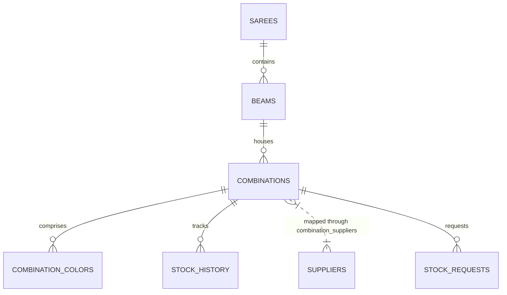

# Sari Stock Management System (KP Creation)

Welcome to the **Sari Stock Management System** (configured for KP Creation) — a professional, enterprise-grade inventory coordinator designed specifically for textile manufacturing and sari wholesale operations. 

This system employs a **hierarchical stock architecture** (Saree ➔ Beams ➔ Combinations ➔ Colors) to match real-world weaving and distribution flows. It features an advanced automated **WhatsApp text parsing engine**, real-time **low-stock alerts**, an **audit ledger** with rollback capabilities, **supplier mapping**, and **role-based access controls** integrated with Supabase.

---

## 📖 Table of Contents
- [Core Features](#-core-features)
- [Architecture & Data Model](#-architecture--data-model)
- [Tech Stack](#-tech-stack)
- [Project Directory Layout](#-project-directory-layout)
- [Getting Started](#-getting-started)
  - [Prerequisites](#prerequisites)
  - [Backend Setup (.env)](#backend-setup-env)
  - [Frontend Setup (.env)](#frontend-setup-env)
  - [Installation](#installation)
  - [Running the Project](#running-the-project)
- [Database Schema & Migrations](#-database-schema--migrations)
- [Advanced Modules](#-advanced-modules)
  - [WhatsApp/Text Stock Parser](#whatsapptext-stock-parser)
  - [Duplicate Entry Detection](#duplicate-entry-detection)
  - [Security & Row-Level Security (RLS)](#security--row-level-security-rls)
- [API Endpoints Reference](#-api-endpoints-reference)

---

## ✨ Core Features

### 🧵 Hierarchical Inventory Architecture
Organizes textiles logically, eliminating structural ambiguity:
* **Saree (Design Series)**: The base product level representing a unique design series code (e.g., `1001A`, `1001B`). Includes names, descriptions, images, prices, and favorite tags.
* **Beams**: Represents the loom warp beams (e.g., *White Beam*, *Black Beam*) associated with a design.
* **Combinations**: Individual stock-holding units (SKUs) tied to specific beams.
* **Combination Colors**: Detailed color allocations (e.g., *F-1 Orange*, *F-2 Green*) including company dye names.

### 📊 Real-Time Stock & Ledger Management
* **Dynamic Adjustments**: Directly increase, decrease, or manually set stock levels.
* **Audit Trail**: Every change is logged into a transaction history ledger showing the old stock, new stock, reason for change, timestamp, and user.
* **One-Click Undo (Rollback)**: Revert accidental stock entries or manual changes instantly.
* **Low Stock Dashboard**: Instantly highlights combinations falling below their minimum stock thresholds.

### 🤝 Supplier Integration & Stock Requests
* **Supplier Profiles**: Store mobile, company name, address, and notes.
* **Supplier-to-Combination Mapping**: Assign primary and alternative suppliers to specific combinations.
* **Stock Requests**: Auto-generate purchase requests for low-stock items.
* **WhatsApp Share**: One-click formatting of purchase requests into WhatsApp messages for fast ordering.

### 🤖 Intelligent WhatsApp Parser Engine
* Paste raw, unformatted text updates (e.g. from WhatsApp groups) containing series, beams, color numbers, and stock edits.
* The backend automatically tokenizes, splits blocks, filters noise, checks duplicates, and updates database records in batch.

---

## 🏗 Architecture & Data Model

Below is a representation of the data hierarchy:



---

## 🛠 Tech Stack

| Component | Technology | Description |
| :--- | :--- | :--- |
| **Frontend** | React 19 (Vite) | Fast UI renderer with Hot Module Replacement (HMR) |
| **Styling** | Material UI (MUI) v9 | Sleek, themeable component system |
| **State/Routing** | React Router v7 | Seamless client routing & route guards |
| **Charts** | Recharts | Visualizes stock statistics and histories |
| **Backend** | Node.js + Express.js | Robust API server with middleware, rate limits, and security |
| **Security** | Helmet + CORS | API header protection and origin validation |
| **Database** | Supabase (PostgreSQL) | Fully-managed RDBMS with RLS and native client auth |
| **AI Integration** | Google Gemini API | Hooked up for demand forecasting and predictive insights |

---

## 📂 Project Directory Layout

```text
Sari_management/
├── client/                     # Frontend Application (React + Vite)
│   ├── src/
│   │   ├── components/         # Reusable layouts, headers, tables, guards
│   │   ├── contexts/           # AuthContext (Supabase) & AppContext (Global State)
│   │   ├── pages/              # Dashboard, SareeForm, LowStock, Suppliers, etc.
│   │   ├── services/           # Axios Interceptor (api.js) & Supabase Client (supabase.js)
│   │   └── theme/              # Light/Dark material design palette customization
│   ├── .env                    # Vite-specific environment variables
│   └── package.json
│
├── server/                     # Backend API (Express.js)
│   ├── config/                 # Supabase configuration helpers
│   ├── controllers/            # Request handlers for sarees, suppliers, dashboard, etc.
│   ├── middleware/             # Role verification, authorization, error handlers
│   ├── routes/                 # Express route mappings
│   ├── services/               # DuplicateDetectionService, AuditLogger
│   │   └── parser/             # Tokenization modules (BlockParser, BeamParser, etc.)
│   ├── .env                    # Backend secret credentials
│   ├── server.js               # Entry point (Port 5000)
│   └── package.json
│
├── database/                   # Database Schemas & Migrations
│   ├── schema.sql              # Main tables (users, sarees, beams, combinations, history)
│   ├── suppliers_migration.sql # Suppliers, Stock requests, and index mappings
│   └── multi_tenant_isolation.sql # RLS Policies and Tenant access configurations
│
├── package.json                # Root package coordinator
└── .env.example                # Blueprint for environmental configs
```

---

## 🚀 Getting Started

### Prerequisites
* **Node.js** (v18 or higher recommended)
* A **Supabase** Project (for PostgreSQL database and Auth)
* Optional: **Google Gemini API Key** (for demand analytics)

---

### Backend Setup (`.env`)
Create a `.env` file under the `server/` directory and configure the secrets. You can copy the values from `.env.example`:

```env
# Server Running Port
PORT=5000
NODE_ENV=development

# Supabase Configurations
SUPABASE_URL=https://your-project-id.supabase.co
# Roles:
SUPABASE_ANON_KEY=your-anon-public-key-here
SUPABASE_SERVICE_ROLE_KEY=your-secret-service-role-key-here (Keep this safe!)

# Authentication
JWT_SECRET=your-secure-jwt-passphrase-here

# Artificial Intelligence (Gemini AI)
GEMINI_API_KEY=your-gemini-api-key-here
```

> [!WARNING]
> The `SUPABASE_SERVICE_ROLE_KEY` bypasses Row-Level Security (RLS). Never expose this key in your client application.

---

### Frontend Setup (`.env`)
Create a `.env` file under the `client/` directory. Vite requires client-side variables to begin with `VITE_`:

```env
# Supabase Client API Configurations
VITE_SUPABASE_URL=https://your-project-id.supabase.co
VITE_SUPABASE_ANON_KEY=your-anon-public-key-here

# Backend Connection endpoint
VITE_API_URL=http://localhost:5000/api
```

---

### Installation
Run the root script to install dependencies for both the `client` and `server` folders in one command:

```powershell
# From the root directory (Sari_management)
npm run install:all
```

Alternatively, you can install them manually:
```powershell
cd client
npm install
cd ../server
npm install
```

---

### Running the Project
The root `package.json` uses `concurrently` to boot both the frontend and backend servers together:

```powershell
# From the root directory (Sari_management)
npm run dev
```

* **Frontend Dashboard**: Runs on [http://localhost:5173](http://localhost:5173) (or the next available port)
* **Backend API Server**: Runs on [http://localhost:5000](http://localhost:5000)

---

## 🗄 Database Schema & Migrations

If setting up the database on a fresh Supabase project, execute the SQL files in the Supabase SQL Editor in the following order:

1. **`database/schema.sql`**: Sets up users, sarees, beams, combinations, colors, stock history, activity logs, settings, and indexes. It also seeds a default administrator and staff member.
2. **`database/suppliers_migration.sql`**: Appends the suppliers directory, many-to-many combination mapping, and the stock requests ledger.
3. **`database/multi_tenant_isolation_v2.sql`** (or relevant RLS files): Implements Row Level Security policies to shield data.

### Seed Logins (Created by `schema.sql`):
* **Administrator**:
  * Username: `admin`
  * Password: `admin123`
* **Staff User**:
  * Username: `staff`
  * Password: `staff123`

---

## ⚙️ Advanced Modules

### WhatsApp/Text Stock Parser
Located in `server/services/parser/`, the engine handles messy stock text inputs:
* **`BlockSplitter`**: Isolates text segments detailing specific sarees.
* **`BeamParser`**: Identifies whether the current context refers to White, Black, or other beams.
* **`ColorParser` & `SeriesParser`**: Extracts color tags (F-Numbers) and series codes.
* **`StockParser`**: Determines stock quantity changes (e.g. `+10`, `-5`, `=25`).

### Duplicate Entry Detection
To prevent multiple employees from recording identical shipments or receipts concurrently:
* **`DuplicateDetectionService`** checks transactions against recent logs (comparing `combination_id`, stock change values, and elapsed time).
* Alerts users if an identical stock operation was submitted within a configurable buffer period.

### Security & Row-Level Security (RLS)
The app implements enterprise authentication security:
* **Express-rate-limit**: Curbs brute-force attacks on auth endpoints.
* **Supabase JWT Verification**: Endpoints are locked behind middleware verifying token claims.
* **PostgreSQL RLS**: Restricts CRUD queries based on the authenticated user's ID and tenant group context.

---

## 🔌 API Endpoints Reference

| Endpoint | Method | Role Required | Description |
| :--- | :--- | :--- | :--- |
| `/api/auth/login` | `POST` | Public | Login via username and password |
| `/api/auth/me` | `GET` | Staff / Admin | Fetches the authenticated user profile |
| `/api/sarees` | `GET` | Staff / Admin | Lists all sarees (supports filters/pagination) |
| `/api/sarees` | `POST` | Staff / Admin | Adds a new saree hierarchy |
| `/api/sarees/:id` | `GET` | Staff / Admin | Detailed view of a saree with its children |
| `/api/stock/adjust` | `POST` | Staff / Admin | Adjusts combination stock levels (logs history) |
| `/api/stock/undo/:historyId` | `POST` | Staff / Admin | Rolls back a previous stock action |
| `/api/suppliers` | `GET`/`POST` | Staff / Admin | Manages supplier list |
| `/api/stock-requests` | `GET`/`POST` | Staff / Admin | Manages and generates purchase requests |
| `/api/parser/parse` | `POST` | Staff / Admin | Validates and processes a WhatsApp text block |
| `/api/dashboard/summary` | `GET` | Staff / Admin | Computes dashboard analytics & predictions |
